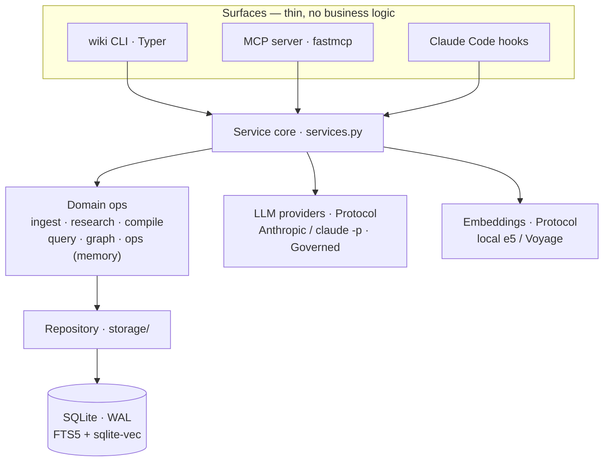
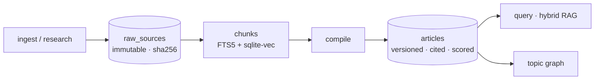

# Architecture

wikiforge is a local-first knowledge base and a **zero-token memory layer** for a coding
agent. This document explains how it is built and, more importantly, *why* — the design
decisions behind the code, in the order they matter.

## The one idea everything follows from

Two very different jobs hide inside "agent memory":

1. **Bookkeeping** — record what changed, and hand the right piece back at the right
   moment. This is constant and automatic, and it has to be **free**, because it runs on
   every single prompt.
2. **Reasoning** — research a topic, synthesize a cited article, answer a hard question.
   This genuinely needs an LLM, and you should pay for it **deliberately**.

Conflating the two is why memory tools are expensive. wikiforge keeps them on separate rails:

- The **free path** — capture, recall, the why-guardrail, MCP excerpt retrieval — runs
  entirely on **local embeddings** and SQL. Zero LLM calls.
- The **paid path** — `research`, `compile`, `query --synthesize`, `changelog --prose` — is
  always something you asked for explicitly, and every call is priced and logged.

Every decision below is downstream of that split.

## Layers

Two thin surfaces and the Claude Code hooks are all wrappers over **one shared service
layer** (`wikiforge/services.py`). Nothing is implemented twice: `wiki compile` on the CLI
and `compile` over MCP call the same function.



| Layer | Modules | Responsibility |
|---|---|---|
| **Surfaces** | `cli/app.py` (Typer), `mcp/server.py` (fastmcp) | Parse, delegate, render. No business logic. |
| **Service core** | `services.py` | The one place operations are implemented. |
| **Domain ops** | `ingest/` `research/` `compile/` `query/` `search/` `graph/` `output/` `lint/` `federation/` `ops/` | Ingestion, research fan-out, compilation, retrieval, graph, exports, and the dev-log memory (`ops/`: capture, recall, why, changelog, impact, consolidate, maintain). |
| **Providers** | `llm/` (Protocol + Anthropic + `claude -p` + Governed), `embed/` | LLM and embeddings behind `Protocol`s — swappable and fakeable. |
| **Storage** | `storage/` (`db.py`, `repository.py`, `schema.sql`, `queries/`) | One SQLite file; SQL lives in `.sql` files, not string literals. |

## Data flow



- **Ingestion** canonicalizes URLs (strip tracking params, normalize host/scheme), extracts
  clean text (`trafilatura` for HTML, `pymupdf` for PDF), and dedups by SHA-256. Raw sources
  are **immutable** — re-ingesting updates provenance, never the stored text.
- **Chunking + indexing** builds an FTS5 full-text index and a `sqlite-vec` vector index over
  the same chunks.
- **Research** fans out persona agents (academic, technical, applied, news, contrarian, …)
  in waves with `asyncio.TaskGroup`, under a per-session USD budget, resumable.
- **Compilation** synthesizes a topic's evidence into a cited article, detects conflicts
  between sources, and computes a confidence score **in code** — source count, diversity,
  recency, evidence strength, minus a conflict penalty — not something asked of the model.
  Incremental by content digest.
- **Retrieval** fuses FTS5 BM25 and `sqlite-vec` KNN via Reciprocal Rank Fusion.

## The zero-token memory loop

Installed as a Claude Code plugin, the everyday loop is four hooks — every one zero-LLM:

| When | Hook | What happens | LLM cost |
|---|---|---|---|
| A task edits files | `Stop` / `SubagentStop` | record a **dev event**: the request (*why*), changed files + `git diff --stat` (*what*), inferred type | none |
| A design decision touched no file | `PreCompact` | sweep the turns nothing else records, before compaction eats them | none |
| You type a prompt | `UserPromptSubmit` | inject the most relevant prior decisions into context (~20 ms) | none |
| The agent is about to edit a file | `PreToolUse` | hand it the past reasoning attached to that file — inform, never block | none |
| The agent asks the wiki | MCP `search_knowledge` | return cited excerpts for the agent to synthesize in its own paid context | none |

Recall embeds your prompt **once**, then gates candidate chunks against their stored vectors
without re-embedding — so the retrieval work is ~20 ms and a fresh project with no chunks
exits before it even loads the model.

## Retrieval: two rankings, fused

BM25 (lexical) and vector KNN (semantic) each miss what the other catches. **Reciprocal Rank
Fusion** merges their rank lists without having to reconcile incompatible score scales.
`--depth deep` adds a cross-encoder rerank — it changes *ranking effort only*, never what is
visible. `--scope` (`all` / `articles` / `devlog`) is what changes visibility.

## LLM providers

`llm/provider.py` defines an `LLMProvider` `Protocol`. Two implementations satisfy it:

- `anthropic_provider.py` — the developer API: hard structured-output guarantee, native web search.
- `claude_code_provider.py` — shells out to `claude -p`, using a Claude subscription (no API credits).

`factory.py` selects one from config. `governed.py` wraps whichever is active **during
automatic maintenance** and rewrites each call's `purpose` to `maintain:*`, so the
maintenance budget (default ≤8 calls / $0.50 per rolling 24 h) is enforced straight from the
call log with no per-job plumbing to keep in sync. In tests, a fake provider is injected.

## Injection defense

The subtle risk: your dev log and ingested sources flow **back into an agent's context**,
which makes them an injection vector. Every untrusted or model-generated string passes one
chokepoint before it is wrapped in a `<source_data>…</source_data>` envelope:

```python
_ENVELOPE_TAG_RE = re.compile(r"<(/?)source_data", re.IGNORECASE)

def seal_source_data(text: str) -> str:
    # Swap the '<' of any <source_data> / </source_data> for '‹' (U+2039):
    # the tag can no longer be parsed as the envelope, yet a real <div> in a
    # code snippet is untouched and the text stays readable.
    return _ENVELOPE_TAG_RE.sub(lambda m: "‹" + m.group(0)[1:], text)
```

It defangs the *delimiter*, not your content — on the way **out** to an agent, not just on
the way in.

## Federation

`wiki peers` registers other wikis as **read-only** peers, opened `mode=ro` — read-only is
SQLite's guarantee at the driver level, not a promise in the code. A peer contributes to
vector paths (`recall`, `query --extract`, `search_knowledge`) only if its *stamped*
embedding model matches the local one; otherwise it is skipped, because feeding vectors from
an unknown model into a gate calibrated at 0.80 is not a risk worth taking on a guess. The
file-indexed reads (`why`, `changelog`, `impact`) contribute regardless — they never touch a
vector.

## Storage

One SQLite file per wiki, **WAL** mode so readers never block the writer (the Viewer UI reads
while the CLI writes). The schema is Python-owned (`storage/schema.sql`); SQL lives in
`storage/queries/*.sql`, not string literals. Content is content-addressed; provenance is a
first-class table, not a column.

## Testing

Providers sit behind `Protocol`s and are injected as fakes; HTTP is stubbed; each test gets a
fresh temporary SQLite database. The full suite runs with **no live keys and no network**:

```bash
uv run pytest          # full suite — providers faked, no network
uv run ruff check .    # lint
uv run mypy wikiforge  # strict type-check
```

## Documented limitations

Deliberate scope, written where a user will hit them (see the README's *Documented
assumptions & limitations* for the full list):

- Dev-event attribution is **file-level**, and events carry **no commit anchor** — capture
  records the files a change touched (that is what `wiki why` indexes), and deliberately
  captures *uncommitted* work.
- Subagents are **captured** but do not yet **receive** memory — the `SubagentStart` payload
  carries no task field to retrieve against.
- An unstamped or mismatched peer contributes nothing to vector paths until its owner
  reindexes it.
